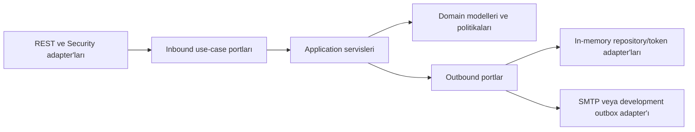

# Backend analizi ve hexagonal mimari

Bu belge, `docs/excel-gap-analysis.md` içindeki mevcut işlevlerin davranışı değiştirilmeden backend'in nasıl ayrıştırıldığını açıklar.
Excel gap analizinde tamamlandı olarak işaretlenen proje, BOQ, üretkenlik, takvim, kaynak, maliyet snapshot'ı,
maliyet raporu, kaynak paylaşımı, ekipman ekonomisi ve sıralı fiyatlandırma akışları aynı REST sözleşmeleriyle korunur.
Gap analizinde gelecek fazlarda yer alan nakit akışı, zaman fazlı histogram, taşeron, versiyon onayı ve Excel import/export
gibi yeni özellikler bu refaktöre özellikle eklenmemiştir.

## Önceki yapının teknik analizi

Önceki backend çalışır durumdaydı ve 17 testle temel davranışları koruyordu; ancak değişiklik maliyetini artıran şu sınır sorunları vardı:

- `ProjectService`, 401 satır içinde proje CRUD, WBS, planlama, bağımlılık, atama, BOQ, kur dönüşümü,
  fiyat snapshot'ı, takvim ve DTO eşleme sorumluluklarını birlikte taşıyordu.
- Controller'lar doğrudan somut servis sınıflarına, servisler de somut in-memory repository sınıflarına bağlıydı.
- Oturum, doğrulama ve parola sıfırlama token'ları kimlik doğrulama iş akışıyla aynı sınıfta saklanıyordu.
- SMTP/development outbox ayrıntıları uygulama servisinin doğrudan bağımlılığıydı.
- Maliyet motorundaki doğru fakat yoğun formüller kısa, çok işlemli satırlar nedeniyle denetlenmesi zor durumdaydı.
- Mimari yönü otomatik koruyan bir test yoktu.

## Yeni bağımlılık yönü



Bağımlılıklar dışarıdan içeriye akar. Application servisleri Spring, controller, config, repository veya adapter paketlerini import etmez.
Domain katmanı da framework ve adapter bağımlılığı taşımaz. Spring yalnızca `ApplicationServiceConfig` içinde nesneleri birbirine bağlar.

## Paketler ve sorumluluklar

| Paket | Rol |
|---|---|
| `domain` | Proje, tahmin, WBS, aktivite, kaynak, BOQ ve maliyet modeli |
| `domain.service` | Takvim, planlama, kur, ekipman ekonomisi ve maliyet hesap politikaları |
| `application.port.in` | HTTP'den bağımsız uygulama kullanım senaryoları |
| `application.port.out` | Repository, token, parola hash'i ve mail sözleşmeleri |
| `application.service` | Proje, planlama, atama, BOQ, kaynak, maliyet, fiyatlandırma ve auth orkestrasyonu |
| `application.service.support` | Aggregate bulma, view eşleme, kur dönüşümü ve fiyat snapshot yardımcıları |
| `dto` | REST ile use-case portlarının ortak, geriye uyumlu istek ve görünüm sözleşmeleri |
| `controller` | Inbound REST adapter'ları; yalnızca inbound portları çağırır |
| `repository` | Outbound in-memory persistence adapter'ları |
| `adapter.out.mail` | SMTP/development outbox adapter'ı |
| `adapter.out.security` | Token saklama, güvenli token üretimi ve BCrypt adapter'ları |
| `config` | Spring wiring, güvenlik ve demo başlangıç verisi |

## Ayrıştırılan kullanım senaryoları

- `ProjectUseCase`: proje, tahmin versiyonu ve WBS yönetimi.
- `PlanningUseCase`: aktiviteler, üretkenlik planı, FS/SS/FF/SF bağımlılıkları ve çalışma takvimi.
- `AssignmentUseCase`: aktivite kaynakları, ekipman ekibi ve proje kadrosu.
- `ResourceRateUseCase`: proje para birimli tahmin snapshot fiyatları.
- `BoqUseCase`: BOQ CRUD ve BOQ → WBS → aktivite izlenebilirliği.
- `CostReportQuery`: otoritatif proje/WBS/aktivite maliyet dökümleri.
- `PricingUseCase`: sıralı on-cost/markup kuralları ve satış fiyatı özeti.
- `ResourceCatalogUseCase`: personel, ekipman, malzeme, yakıt ve maliyet kataloğu.
- `AuthenticationUseCase` ve `UserAdministrationUseCase`: login, doğrulama, parola sıfırlama ve kullanıcı yönetimi.

## Korunan hesap ve davranış kuralları

Refaktör aşağıdaki kuralları değiştirmez:

- Aktivite süresi `ceil(miktar / günlük üretim)` olarak ve çalışma günlerine yerleştirilerek hesaplanır.
- Bağımlılıklarda çevrim engellenir; lag, proje çalışma takvimine göre uygulanır.
- Atama tarihleri aktivite yeniden planlandığında senkronize edilir.
- Tahmin fiyatları global katalogdan snapshot olarak alınır; katalog sonradan değişince geçmiş proje sessizce değişmez.
- Para birimi değişikliği yalnızca proje snapshot'larını ve proje/aktivite ek maliyetlerini dönüştürür.
- Personel, ekipman adedi, utilization, ekip ekibi, operating/standby yakıtı, malzeme firesi,
  geçerlilik tarihi ve vergi hesapları aynı formülleri kullanır.
- Maliyet raporu proje, WBS ve aktivite toplamlarını aynı backend motorundan üretir.
- Fiyatlandırma kuralları sıra ile `ESTIMATED_COST` veya `RUNNING_TOTAL` matrahına uygulanır.
- Kaynak sahipliği, paylaşım kapatma, mevcut atamayı koruma ve kullanımdayken silmeyi engelleme kuralları korunur.
- Opaque oturum süresi 8 saat; doğrulama 24 saat; parola sıfırlama 30 dakika ve tek kullanımlıktır.

## Değiştirilebilir adapter'lar

Kalıcı veritabanına geçişte `ProjectRepositoryPort`, `ResourceRepositoryPort` ve `UserRepositoryPort`
arayüzlerini uygulayan yeni adapter'lar eklenebilir. Application servisleri ve controller'lar değişmez.
Benzer biçimde mail veya token altyapısı, ilgili outbound portun başka bir uygulamasıyla değiştirilebilir.

## Otomatik mimari koruması

`HexagonalArchitectureTests` şu kuralları build sırasında doğrular:

- Domain framework veya adapter katmanına bağımlı olamaz.
- Application çekirdeği Spring'e ya da somut adapter/repository sınıflarına bağımlı olamaz.
- REST controller'ları somut application service veya outbound adapter import edemez.
- In-memory repository'ler outbound port uygulamak zorundadır.

Doğrulama komutu:

```powershell
.\mvnw.cmd clean test
```
