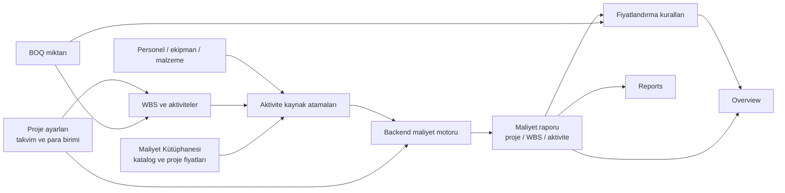

# Construct Cost Estimator

## Ürün sunumu, sayfa rehberi ve entegrasyon / hesap doğruluğu denetimi

**Rapor tarihi:** 5 Ağustos 2026  
**İncelenen sürüm:** Mevcut çalışma alanındaki frontend ve backend  
**Rapor amacı:** Ürünü potansiyel müşteriye anlatmak, sayfalar arası veri akışını doğrulamak ve satış öncesi teknik riskleri açıkça göstermek.

---

## 1. Yönetici özeti

Construct Cost Estimator; inşaat, denizcilik, altyapı ve benzeri proje bazlı işlerde program, kaynak, BOQ, maliyet ve teklif fiyatını tek zincirde birleştiren web tabanlı bir maliyet planlama uygulamasıdır.

Ürünün temel değer önerisi şudur:

> Excel'de birbirinden kopuk iş programı, ekipman listesi, personel planı, malzeme hesabı ve teklif katsayılarını tek bir izlenebilir proje modelinde birleştirmek.

Bugünkü sürümde aşağıdaki ana iş akışı çalışmaktadır:

1. Proje oluşturulur.
2. WBS ve aktiviteler tanımlanır.
3. BOQ miktarı ve üretkenlik aktivite süresini besler.
4. Personel, ekipman ve malzemeler aktivitelere atanır.
5. Kaynak fiyatları, çalışma takvimi, kullanım ve fire bilgileri backend maliyet motorunda hesaplanır.
6. Genel gider, risk, finansman, vergi ve kâr kuralları sıralı biçimde uygulanır.
7. Overview ve Reports ekranlarında proje maliyeti ve ticari sonuç gösterilir.

### Bugünkü ticari konumlandırma

Ürün, **çalışan ve gösterilebilir bir fonksiyonel MVP / pilot çözüm** seviyesindedir. Hesap motorunun ana senaryoları testlidir ve temel proje zinciri kurulmuştur. Ancak bugün itibarıyla kurumsal üretim ortamına “olduğu gibi” kurulmaya hazır değildir.

En önemli satış öncesi engel, proje, kaynak ve kullanıcı verilerinin veritabanında değil uygulama belleğinde tutulmasıdır. Uygulama yeniden başlatıldığında bellekte oluşturulan veriler kaybolur. Ayrıca tenant/proje üyeliği bazlı yetkilendirme, audit trail, yedekleme ve kalıcı oturum altyapısı henüz yoktur.

Bu nedenle doğru satış dili:

- “Çalışan maliyet planlama ve teklif MVP'si”
- “Pilot uygulamaya hazır hesap ve iş akışı temeli”
- “Excel süreçlerini ürüne dönüştüren genişletilebilir platform”

Bugün için kullanılmaması gereken satış dili:

- “Tam üretime hazır kurumsal SaaS”
- “Tüm inşaat maliyet senaryolarını eksiksiz kapsıyor”
- “Tüm ekranlarda gösterilen her ara değer aynı resmi hesap motorundan geliyor”

---

## 2. Bir dakikalık satış anlatımı

Construct Cost Estimator, bir projenin iş programını, kaynak ihtiyacını ve teklif fiyatını aynı veri modeli üzerinde yönetir. Kullanıcı önce WBS ve aktiviteleri oluşturur; BOQ miktarlarını, üretim kapasitesini ve çalışma takvimini tanımlar. Ardından personel, ekipman ve malzemeleri aktivitelere atar. Sistem; saatlik, günlük, aylık veya birim bazlı fiyatları, ekipman çalışma/bekleme yakıtını, malzeme firesini, vergileri ve para birimi dönüşümlerini backend üzerinde hesaplar.

Maliyet tamamlandıktan sonra genel gider, risk, contingency, finansman ve kâr kuralları istenen sırayla uygulanır. Yönetici Overview ekranında toplam maliyeti, satış fiyatını, net kârı, marjı ve BOQ farkını görür; mühendis ise WBS ve aktivite seviyesine kadar inebilir.

Sistemin Excel'e göre temel avantajı, bir hücrenin neden değiştiğini aramak yerine kaynağın, aktivitenin ve fiyatın izlenebilir bir kayıt olarak yönetilmesidir.

---

## 3. Hedef kullanıcılar

### Proje mühendisi / estimator

- Proje, WBS ve aktivite oluşturur.
- BOQ ve üretkenlik bilgilerini yönetir.
- Aktivitelere kaynak atar.
- Kaynak kataloglarını ve maliyet bileşenlerini düzenler.
- Fiyatlandırma kurallarını oluşturur.

### Proje yöneticisi

- Overview, program, BOQ, kaynak, fiyatlandırma ve raporları görüntüler.
- Proje ayarlarını, tarihleri, para birimini ve kurları yönetebilir.
- Mühendis rolüne ait operasyonel düzenlemeler arayüzde kapalıdır.

### Sistem yöneticisi

- Kullanıcıları listeler.
- Engineer, Manager veya Admin rolüyle yeni kullanıcı oluşturur.
- E-posta doğrulama durumunu izler.
- Geliştirme ortamındaki doğrulama bağlantılarını görüntüler.

---

## 4. Ürün içindeki ana veri zinciri



Ana maliyet ve fiyatlandırma zinciri backend tarafından hesaplanmaktadır. Overview üst toplamı, Cost Library güncel proje maliyeti, Pricing özeti ve Reports toplamı aynı backend maliyet motoruna dayanır.

---

## 5. Sayfa sayfa ürün rehberi

### 5.1 Giriş ve hesap yönetimi

**Amaç:** Güvenli kullanıcı girişi ve hesap yaşam döngüsü.

Başlıca yetenekler:

- E-posta ve şifre ile giriş
- Yeni Manager hesabı kaydı
- E-posta doğrulama
- Şifremi unuttum ve tek kullanımlık şifre sıfırlama bağlantısı
- BCrypt şifre özeti
- Sekiz saatlik bearer token oturumu

Satış notu: SMTP gönderimi varsayılan olarak kapalıdır; geliştirme mailbox'ı kullanılır. Canlı ortamda SMTP ve public URL yapılandırılmalıdır.

### 5.2 Admin Console

**Amaç:** Kullanıcı erişimini merkezi olarak yönetmek.

Başlıca yetenekler:

- Toplam, doğrulanmış ve bekleyen kullanıcı sayıları
- Kullanıcı, rol, e-posta durumu ve hesap durumu listesi
- Engineer, Manager veya Admin rolüyle yeni kullanıcı oluşturma
- Geliştirme e-posta kutusundaki doğrulama aksiyonunu açma

Sınır: Mevcut kullanıcıyı düzenleme, rol değiştirme, devre dışı bırakma veya silme arayüzü yoktur.

### 5.3 Overview / Genel Bakış

**Amaç:** Projenin yönetici özeti ve ticari fotoğrafı.

Gösterilen bilgiler:

- Proje adı ve tarih aralığı
- Backend tarafından hesaplanan tahmini proje maliyeti
- WBS, aktivite, kaynak ataması ve katalog kaynak sayıları
- Satış fiyatı
- Genel gider/risk toplamı
- Net kâr ve kâr marjı
- BOQ toplamı ve satış fiyatına göre fark
- WBS → aktivite → atanmış kaynak görünümü

Doğruluk notu: Üst maliyet ve ticari özet backend sonucudur. Aktivite kartlarının sağındaki tekil aktivite tutarı ise halen frontend tahmini formülünden gelir ve resmi Reports değeriyle sapabilir.

### 5.4 Schedule / İş Programı

**Amaç:** Proje takvimini ve aktivite planını görsel olarak yönetmek.

Başlıca yetenekler:

- WBS ekleme
- WBS olmadan aktivite oluşturmayı engelleme
- Aktivite kodu, türü, adı, başlangıç/bitiş tarihi
- Planlanan miktar ve günlük üretim kapasitesi
- Otomatik süre hesabı
- Gün/hafta/ay Gantt yakınlaştırma
- Aktivite çubuğundan tarih değiştirme
- Aktiviteye personel, ekipman ve malzeme atama
- Atama miktarı, kullanım oranı ve tarih aralığı
- Ekipmanda çalışma/bekleme saatleri
- Malzemede gerekli miktar ve fire

Bağlantı: Aktivite veya atama değişikliği backend'e kaydedilir; ardından program ve maliyet raporu yenilenir.

Doğruluk notu: Gantt üzerindeki “Est.” araç ipucu resmi maliyet değildir. Takvim günü, snapshot fiyatı, vergi, geçerlilik tarihi ve tüm maliyet bileşenlerini eksiksiz kullanmaz.

### 5.5 BOQ ve Planlama

**Amaç:** Keşif/teklif miktarını programa bağlamak.

Başlıca yetenekler:

- BOQ kodu, açıklaması, birimi, miktarı, birim fiyatı ve para birimi
- BOQ'yu WBS'ye ve isteğe bağlı aktiviteye bağlama
- BOQ oluşturma, düzenleme ve silme
- Bağlı/bağlantısız BOQ sayısını izleme
- Aktivite miktarı ve günlük üretkenlik düzenleme
- Otomatik çalışma günü süresi
- FS, SS, FF ve SF bağımlılıkları
- Gecikme günü ve çevrim kontrolü
- Proje çalışma takvimi ve çoklu vardiya

Önemli bağlantı: Bir BOQ aktiviteye bağlanırsa BOQ miktarı aktivitenin planlanan miktarını günceller; aktivite otomatik planlanıyorsa süre ve bağımlı aktiviteler yeniden hesaplanır.

### 5.6 Resources / Personel

**Amaç:** Aktivitelere atanabilecek iş gücünü yönetmek.

Başlıca yetenekler:

- Kod, ad, meslek ve açıklama
- İlk ücret/fiyat ve saat/gün/hafta/ay periyodu
- Projeye özel veya ortak kaynak
- Kaynak paylaşımını sonradan değiştirme
- Sahibi olunan ve kullanılmayan kaynağı silme

Sınır: Ücret paketi, fazla mesai politikası, izin/bilet, ülke yükleri ve vize/oturum maliyetleri için ayrıntılı UI henüz yoktur.

### 5.7 Resources / Ekipman

**Amaç:** Makine ve ekipman kataloğunu yönetmek.

Başlıca yetenekler:

- Kod, ad, ekipman türü ve açıklama
- Saatlik/günlük/haftalık/aylık ekipman fiyatı
- Yakıt/enerji türü ve birim fiyatı
- Çalışma ve bekleme tüketimlerinin ayrı tanımlanması
- Projeye özel veya ortak kapsam
- Paylaşım ve kontrollü silme

Cost Library ile birlikte özmal/kiralık, alış bedeli, hurda değeri, faydalı ömür, amortisman, bakım ve sigorta yönetilir.

### 5.8 Resources / Malzeme

**Amaç:** Sarf ve kalıcı malzeme kataloğunu yönetmek.

Başlıca yetenekler:

- Kod, ad, malzeme türü ve varsayılan birim
- Birim fiyat
- Projeye özel veya ortak kapsam
- Paylaşım ve kontrollü silme

Cost Library ile birlikte tedarikçi, termin süresi, minimum sipariş miktarı ve varsayılan fire yönetilir.

### 5.9 Cost Library / Maliyet Kütüphanesi

**Amaç:** Kaynak maliyet bileşenlerini ve aktif proje fiyatlarını merkezi olarak yönetmek.

Başlıca yetenekler:

- Kaynağa göre açılır maliyet grupları
- Katalog ve aktif proje fiyatlarının ayrı görünümü
- Saat, gün, hafta, ay, birim ve sabit hesap bazları
- Fiyat geçerlilik tarihleri
- Vergiye tabi olma ve vergi oranı
- Aktif proje fiyat override'ı
- Katalog değişikliğini aktif projeye otomatik senkronize etme
- Güncel backend proje maliyetini aynı ekranda gösterme
- Ekipman ekonomisi ve malzeme tedarik profilleri

Önemli açıklama: Kapalı grup üzerinde gösterilen “katalog toplamı” veya “aktif proje fiyat toplamı”, farklı hesap bazlarındaki birim fiyatların aritmetik toplamıdır; proje maliyeti değildir. Finansal olarak güvenilecek değer “Güncel Proje Maliyeti” kartıdır.

### 5.10 Pricing & Profit / Fiyatlandırma ve Kâr

**Amaç:** Tahmini maliyeti satış fiyatına dönüştürmek.

Başlıca yetenekler:

- Genel gider
- Risk
- Contingency
- Teminat
- Finansman
- Vergi
- Kâr
- Kural sırası
- Tahmini maliyet veya yürüyen toplam matrahı
- Aktif/pasif kural
- Satış fiyatı, brüt/net kâr, marj ve BOQ farkı

Hesap, seçilen sıra üzerinden backend'de yürütülür. `RUNNING_TOTAL` seçilen kurallar bir önceki eklenmiş tutarı da matraha dahil eder.

### 5.11 Reports / Raporlar

**Amaç:** Resmi maliyet kırılımını proje, WBS ve aktivite seviyesinde göstermek.

Gösterilen kategoriler:

- Personel
- Ekipman
- Malzeme
- Yakıt/enerji
- Konaklama, ulaşım, dolaylı gider ve vergi
- Proje toplamı

Bu ekran kendi formülünü çalıştırmaz; backend `cost-report` sonucunu gösterir. Mevcut sürümde maliyet doğruluğu için esas alınması gereken ekran budur.

### 5.12 Project Settings / Proje Ayarları

**Amaç:** Proje kimliği ve hesap ortamını yönetmek.

Başlıca yetenekler:

- Proje kodu, adı, açıklaması ve durumu
- Başlangıç ve bitiş tarihi
- Arayüz dili
- Proje para birimi
- Manuel USD/TRY ve EUR/TRY kurları
- Hesaplanan EUR/USD çapraz kuru

Sınır: Proje tarih aralığı aktivitelerin proje sınırları içinde kalmasını zorunlu kılmaz. Ayrıca yalnızca kur değiştiğinde mevcut yabancı para kaynak snapshot'ları katalogdan otomatik yeniden değerlenmez.

---

## 6. Backend hesap modeli

### Personel ve ekipman temel maliyeti

Hesap bazı aşağıdaki faktörlerden birini kullanır:

- Saatlik: etkin çalışma saati
- Günlük/vardiya: çalışma günü × adet
- Haftalık: çalışma günü / 7 × adet
- Aylık: çalışma günü / 30 × adet
- Birim: miktar
- Sabit: 1

Kullanım oranı saatlik etkin işe uygulanır.

### Ekipman yakıtı

```text
Tüketim = çalışma tüketimi × çalışma saati
        + bekleme tüketimi × bekleme saati

Yakıt maliyeti = tüketim × yakıt birim fiyatı
```

Çalışma saati ekipman adedi ve kullanım oranından etkilenir. Bekleme saati ayrıca girilir.

### Malzeme

```text
Hesaplanan miktar = gerekli miktar × (1 + fire oranı / 100)
Malzeme maliyeti = hesaplanan miktar × birim fiyat
```

### Vergi

```text
Vergi = vergiye tabi tutar × vergi oranı / 100
```

### Fiyatlandırma

```text
Kural tutarı = seçilen matrah × oran / 100
Yeni yürüyen toplam = eski yürüyen toplam + kural tutarı
```

Satış fiyatı bütün aktif kurallardan sonraki yürüyen toplamdır. Net kâr, `PROFIT` türündeki kuralların toplamıdır.

---

## 7. Sayfalar arası bağlantı denetimi

| Değişiklik | Beklenen tüketiciler | Mevcut durum | Denetim sonucu |
|---|---|---|---|
| Proje değiştirme | Program, kaynaklar, rapor, BOQ, takvim, pricing | Tüm ana state temizlenip yeniden yükleniyor | **Doğrulandı** |
| Aktivite tarihi değiştirme | Gantt, atama tarihleri, maliyet, pricing, rapor | Backend kaydı sonrası tüm proje yeniden yükleniyor | **Doğrulandı** |
| Aktivite miktarı/üretkenlik | Süre, bağımlılar, Gantt, maliyet | Backend yeniden planlıyor ve frontend projeyi yeniliyor | **Doğrulandı** |
| Kaynak atama/güncelleme | Aktivite, proje fiyat snapshot'ı, maliyet, pricing | Atama sonrası maliyet ve fiyatlar yenileniyor | **Doğrulandı** |
| Kaynak atamasını kaldırma | Aktivite, maliyet, pricing | Maliyet raporu yenileniyor; pricing maliyet raporu callback'iyle yenileniyor | **Doğrulandı** |
| Katalog fiyatı değiştirme | Aktif proje snapshot'ı, maliyet, pricing | Aktif kaynak fiyatları senkronize edilip maliyet yenileniyor | **Doğrulandı** |
| Aktif proje fiyat override'ı | Maliyet, pricing, Overview, Reports | Fiyat kaydı sonrası backend raporu yenileniyor | **Doğrulandı** |
| Ekipman ekonomisi | Otomatik amortisman/bakım/sigorta, proje maliyeti | Eski generated snapshot'lar temizlenip aktif proje yenileniyor | **Doğrulandı** |
| Malzeme varsayılan firesi | Yeni malzeme atamaları | Yeni atamada varsayılan uygulanıyor | **Koşullu** — mevcut atamalar değişmez |
| BOQ oluşturma/düzenleme | BOQ, bağlı aktivite, süre, pricing, Overview | Tüm proje yeniden yükleniyor | **Doğrulandı** |
| BOQ silme | BOQ, pricing BOQ değeri ve farkı | Yalnızca BOQ raporu yenileniyor | **Açık** — Pricing/Overview geçici olarak eski kalır |
| Bağımlılık ekleme/silme | Ardıl tarihler, Gantt, atamalar, maliyet | Proje yeniden yükleniyor | **Doğrulandı** |
| Takvim/vardiya değiştirme | Otomatik süreler, atamalar, maliyet, pricing | Backend yeniden planlıyor, proje yeniden yükleniyor | **Doğrulandı** |
| Pricing kuralı değiştirme | Pricing ve Overview | Kurallar ve ticari özet yeniden yükleniyor | **Doğrulandı** |
| Proje para birimini değiştirme | Snapshot fiyatlar, rapor, pricing | Proje fiyatları dönüştürülüp rapor yenileniyor | **Koşullu** |
| Yalnızca döviz kurunu değiştirme | Yabancı katalog kaynaklarının proje snapshot'ı, BOQ | Mevcut snapshot katalogdan yeniden değerlenmiyor; Planning BOQ özeti yenilenmiyor | **Açık** |
| Resource paylaşımı | Diğer proje katalogları ve yeni atamalar | Backend proje kapsam filtresi ve sahiplik kontrolü var | **Doğrulandı** |
| Resource silme | Katalog | Sahiplik ve kullanım kontrolü var; kullanılan kayıt engelleniyor | **Doğrulandı** |

---

## 8. “Tüm değerler doğru hesaplanıyor mu?” sorusunun net cevabı

**Hayır, bugün uygulamadaki her görünen ara değer için koşulsuz olarak “aynı resmi hesapla doğrudur” denemez.**

Ancak şu ayrım önemlidir:

### Güvenilir ve resmi kabul edilebilecek değerler

- Reports ekranındaki proje, WBS ve aktivite maliyetleri
- Overview üst tahmini maliyeti
- Cost Library “Güncel Proje Maliyeti”
- Pricing ekranındaki estimated cost, satış fiyatı, kâr ve marj
- Backend BOQ traceability toplamı

Bu değerler backend hesap servislerinden gelir.

### Yaklaşık veya bağlama bağlı değerler

- Overview aktivite kartlarının sağındaki aktivite toplamları
- Gantt resource araç ipucundaki “Est.” maliyet
- Cost Library kapalı gruplarındaki birim fiyat toplamları

İlk iki değer frontend yardımcı formülü kullanır. Takvim, snapshot fiyatı, kur, vergi, geçerlilik tarihi, fire ve bütün maliyet kalemleriyle resmi backend hesabını birebir tekrar etmez.

### Modelin doğru hesapladığı doğrulanmış senaryolar

- Saatlik personel ve utilization
- Günlük ekipman fiyatı
- Çalışma ve bekleme yakıtı
- Ekipman ve ekip adedi
- Malzeme gerekli miktarı ve fire
- Vergi
- Fiyat geçerlilik tarihleri
- Proje kadrosunda adet, tahsis ve takvim saati
- Çalışma günü bazlı otomatik süre
- Bağımlılık ve çevrim kontrolü
- BOQ → aktivite miktarı bağlantısı
- Sıralı on-cost ve kâr kuralları
- Resource sahipliği, paylaşım ve kullanımda silme engeli

---

## 9. Satış öncesi düzeltilmesi gerekenler

### P0 — Üretim ve veri güvenliği engelleri

1. **Kalıcı veritabanı yok.** `ProjectRepository`, `ResourceRepository` ve `UserRepository` `ConcurrentHashMap` kullanıyor. PostgreSQL gibi kalıcı veritabanı, migration ve transaction altyapısı kurulmalı.
2. **Tenant/proje üyeliği yok.** Her Engineer veya Manager API üzerinden bütün projeleri okuyabilir; Engineer bütün projeleri değiştirebilir. Organizasyon, proje üyeliği ve proje bazlı yetki kontrolü eklenmeli.
3. **Audit trail yok.** Fiyatı, BOQ'yu, programı veya kuralı kimin ne zaman değiştirdiği kaydedilmiyor.
4. **Yedekleme ve felaket kurtarma yok.** Veritabanı, yedek politikası ve geri yükleme testi hazırlanmalı.
5. **Canlı e-posta varsayılan olarak kapalı.** SMTP, domain, TLS ve teslimat izleme yapılandırılmalı.

### P1 — Hesap ve ekran tutarlılığı

1. Overview aktivite tutarları backend aktivite raporuna bağlanmalı.
2. Gantt “Est.” maliyeti kaldırılmalı veya backend activity cost endpoint'ine bağlanmalı.
3. BOQ silme sonrası Pricing ve Overview özeti de anında yenilenmeli.
4. Kur değişiminde mevcut yabancı kaynak snapshot'ları katalog kaynak para biriminden yeniden değerlenmeli.
5. Settings sonrası Planning BOQ toplamı yeniden yüklenmeli.
6. Malzeme varsayılan fire değişiminin yalnızca yeni atamalara mı, mevcut atamalara da mı uygulanacağı açık bir kullanıcı seçimi olmalı.
7. Bir ekipmanda birden fazla yakıt türü/fiyatı desteklenecekse tüketim ve fiyatlar yakıt türü üzerinden eşleştirilmeli; mevcut motor tüm tüketimleri ve tüm `FUEL` fiyatlarını bağımsız uygular.
8. Proje başlangıç/bitiş tarihleri ile aktivite tarihleri arasında sınır validasyonu eklenmeli.
9. Cost Library grup toplamları “fiyat kalemleri toplamı” olarak açıkça işaretlenmeli veya farklı hesap bazları nedeniyle kaldırılmalı.

### P2 — Ürün kapsamını güçlendirecek başlıklar

- Aylık/haftalık kaynak histogramları
- Zaman fazlı maliyet ve nakit akışı
- Ekipman crew yönetim arayüzü
- Proje dolaylı kadro yönetimi
- Proje seviyesi ek maliyet CRUD
- Taşeron ve teklif karşılaştırma modülü
- Mobilizasyon/demobilizasyon sihirbazı
- Estimate version kopyalama, baseline, onay ve karşılaştırma
- Excel import ve Excel/PDF export
- Kritik yol ve float görünümü
- ROI ve ekipman yatırım analizi
- Proje paylaşım butonunun gerçek üyelik akışına bağlanması
- Bildirim merkezi

---

## 10. Test ve teknik doğrulama sonucu

Denetim sırasında tam test paketleri çalıştırılmıştır.

### Backend

- **17 test / 17 başarılı**
- Auth API: 3
- CostCalculator: 5
- Uygulama başlangıcı: 1
- Faz 1 API: 1
- Faz 3/4 API: 1
- Project API: 5
- Resource sharing/deletion API: 1

### Frontend

- **14 test / 14 başarılı**
- 5 test dosyasının tamamı geçti.

### Production build

- Angular production build başarılı.
- Başlangıç bundle'ı 500 kB warning bütçesini yaklaşık 10 kB aşıyor.
- Gantt component stili 8 kB warning bütçesini yaklaşık 3.35 kB aşıyor.

### Test kapsamının sınırı

Testlerin geçmesi bütün ekran bağlantılarının uçtan uca otomatik test edildiği anlamına gelmez. Backend hesap senaryoları güçlü biçimde testlidir; frontend testleri ağırlıklı olarak bileşen görünürlüğü ve temel aksiyonları kontrol eder. App seviyesindeki HTTP orkestrasyonu için Playwright/Cypress benzeri uçtan uca test paketi henüz yoktur.

---

## 11. Önerilen satış demosu

1. Engineer hesabıyla giriş yapın.
2. Yeni proje oluşturun.
3. İş Programı ekranından WBS ekleyin.
4. Miktar ve günlük kapasiteyle otomatik aktivite oluşturun.
5. BOQ kalemini aktiviteye bağlayıp miktarın programa geçtiğini gösterin.
6. Ekipman ve malzeme oluşturun; ortak kaynak seçeneğini gösterin.
7. Aktiviteye ekipman atayıp çalışma/bekleme saatlerini girin.
8. Cost Library'de fiyatı değiştirip “Güncel Proje Maliyeti”nin yenilendiğini gösterin.
9. Pricing ekranında genel gider, risk ve kâr kurallarını sıralayın.
10. Overview ve Reports ekranlarında toplamdan WBS/aktivite kırılımına inin.

Demo sırasında Overview aktivite satırı veya Gantt “Est.” tutarını resmi raporla karşılaştırmalı bir doğruluk kanıtı olarak kullanmayın; resmi kaynak Reports ekranıdır.

---

## 12. Sonuç

Construct Cost Estimator'ın ürün fikri, ekran akışı ve backend hesap omurgası güçlüdür. Excel çalışmalarındaki temel zincirin önemli bir bölümü ürüne taşınmıştır: BOQ, üretkenlik, program, kaynak ataması, maliyet, fiyatlandırma ve rapor birbirine bağlıdır.

Bugünkü sürüm bir müşteriye etkileyici biçimde demo edilebilir ve kontrollü pilot için temel oluşturur. Bununla birlikte kalıcı veritabanı, proje bazlı yetkilendirme ve audit trail tamamlanmadan canlı müşteri verisiyle kurumsal üretim kullanımı önerilmez.

Hesap tarafında resmi backend raporu güvenilir ana kaynak olarak konumlandırılmalıdır. Frontend'deki yaklaşık aktivite maliyetleri backend'e bağlandıktan ve üç yenileme açığı giderildikten sonra ürünün satış anlatısı ile ekrandaki bütün rakamlar çok daha tutarlı hale gelecektir.

